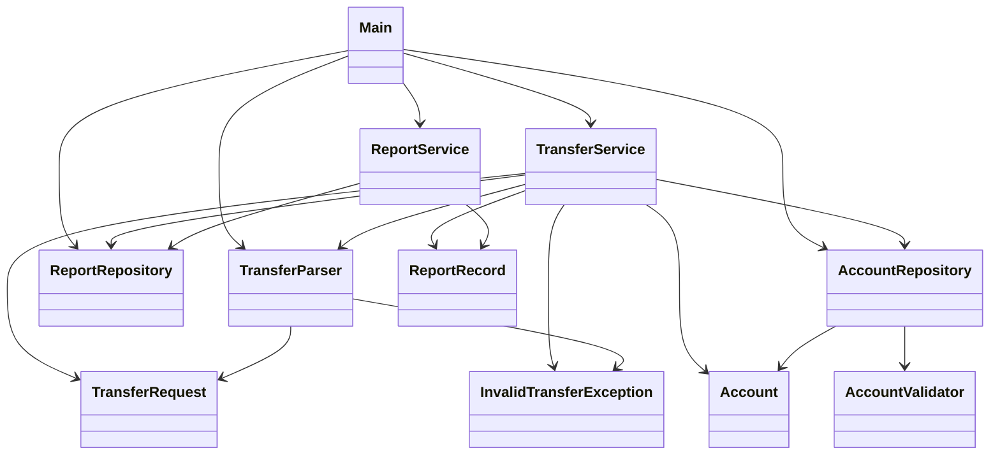

# CourseWork Money Transfer App

Console Java application for parsing money transfer files and updating account balances.

## Features

- Reads transfer files from `src/CourseWork/input`.
- Processes only `.txt` files.
- Moves processed `.txt` files to `src/CourseWork/archive`.
- Updates account balances in `src/CourseWork/data/accounts.txt`.
- Appends operation history to `src/CourseWork/report/transfers_report.txt`.
- Supports integer and decimal transfer amounts.
- Can print all report records or records for a selected date range.

## Input File Format

The transfer file may contain any text, but it must include:

- source account number in `XXXXX-XXXXX` format;
- target account number in `XXXXX-XXXXX` format;
- transfer amount.

Example:

```txt
from account: 11111-11111
to account: 22222-22222
amount: 100.25
comment: test transfer
```

## Accounts File Format

Accounts are stored as:

```txt
11111-11111;1000.00
22222-22222;1500.50
```

## Run

Compile and run `CourseWork.Main` from the project root.

```powershell
javac -encoding UTF-8 -d out (Get-ChildItem -Path src\CourseWork -Recurse -Filter *.java | Select-Object -ExpandProperty FullName)
java -cp out CourseWork.Main
```

Menu:

- `1` - parse transfer files from input directory;
- `2` - show all operations from report;
- `3` - show report records by date range;
- `0` - exit.

## Class Diagram


